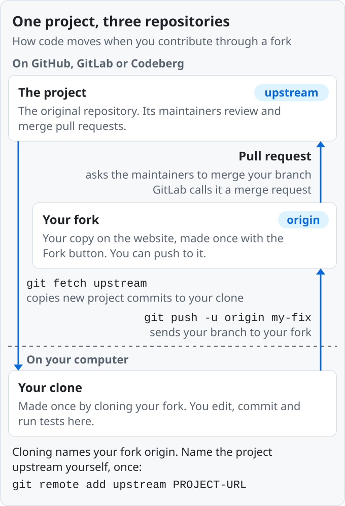

# Contributing to Open Source

How to get a change merged into an open source project you do not run, and keep contributing after that. This guide is for anyone without merge rights; maintainers, see [If you run a project](#if-you-run-a-project). Every fact links to its source, next to the step it supports.

Last reviewed October 2026.

## Ground rules

[GitHub puts it this way](https://github.blog/open-source/maintainers/rethinking-open-source-mentorship-in-the-ai-era/): "The cost to create has dropped. The cost to review hasn't."

1. [Search open and closed issues and pull requests](https://opensource.guide/how-to-contribute/) (requests to merge a change) before you write code ([step 3](#3-check-nobody-else-is-on-it-and-get-a-yes)). [A study of 21 popular GitHub projects](https://homepages.dcc.ufmg.br/~figueiredo/disciplinas/papers/icse18steinmacher.pdf) found duplicated or superseded work the top reason pull requests were not accepted, both in their authors' reports and in a manual check of 263 of them.
2. [Get a maintainer's yes](https://opensource.guide/how-to-contribute/) before you build anything bigger than a small fix ([step 3](#3-check-nobody-else-is-on-it-and-get-a-yes)). In [the same study](https://homepages.dcc.ufmg.br/~figueiredo/disciplinas/papers/icse18steinmacher.pdf), those authors ranked clashing with the maintainers' vision second.
3. [Stay with your pull request](https://curl.se/dev/contribute.html) until it merges ([step 7](#7-get-through-review)), or [say in it that you are stepping away](https://yuyue.github.io/res/paper/abPR_TSE2021.pdf) so someone can take over. Difficulty addressing maintainers' review comments was a likely reason for 46% of 354 abandoned pull requests in [a study of 10 large GitHub projects](https://arxiv.org/html/2110.15447).
4. Follow [coordinated vulnerability disclosure](https://oss-vulnerability-guide.openssf.org/maintainer-guide): [keep suspected vulnerabilities out of public issues](https://docs.github.com/en/code-security/concepts/vulnerability-reporting-and-management/coordinated-disclosure), pull requests and chat. Use the project's SECURITY.md channel or, on GitHub, [Report a vulnerability](https://github.blog/changelog/2026-04-02-the-security-tab-is-now-security-quality/) (Security & quality tab), where enabled. With neither, open an issue asking only for a security contact. [Reproduce the problem](https://curl.se/dev/contribute.html) first, and report it in your own words.
5. Opening or installing an unfamiliar repository [can run its code without asking](https://code.visualstudio.com/docs/editing/workspaces/workspace-trust). In VS Code, keep it in Restricted Mode until you have reviewed it, .vscode folder included. This npm command [skips package.json install scripts](https://docs.npmjs.com/cli/v12/using-npm/config) until you have read them:

   ```sh
   npm install --ignore-scripts
   ```

   Run code that a stranger sends you, such as a job coding test, only in an isolated, throwaway environment like a [virtual machine](https://www.microsoft.com/en-us/security/blog/2026/03/11/contagious-interview-malware-delivered-through-fake-developer-job-interviews/).
6. Keep passwords, tokens and keys in files Git ignores; check what you are about to commit ([step 5](#5-make-the-change)). Pushed one? [Revoke or rotate it first](https://docs.github.com/en/authentication/keeping-your-account-and-data-secure/removing-sensitive-data-from-a-repository): deleting it from history is not enough.
7. Submit only work you [have the right to submit](https://developercertificate.org/). If it relates to your job or work time, [ask your employer first](https://cla.developers.google.com/about/google-individual): they may own it. Never copy in incompatibly licensed code: [Apache-2.0 code cannot go into a GPLv2-only project](https://www.gnu.org/licenses/license-list.html).
8. Pushing to a public project makes your commit email public for good: commits and [sign-offs](#2-read-the-projects-rules) record it, and where the project uses the [Developer Certificate of Origin](https://developercertificate.org/) (DCO), you agree the project keeps it indefinitely. Before your first commit, keep your personal email private ([step 4](#4-set-up-your-copy)).

## Contents

- [Ground rules](#ground-rules)
- [1. Choose a project and a first task](#1-choose-a-project-and-a-first-task)
- [2. Read the project's rules](#2-read-the-projects-rules)
- [3. Check nobody else is on it, and get a yes](#3-check-nobody-else-is-on-it-and-get-a-yes)
- [4. Set up your copy](#4-set-up-your-copy)
- [5. Make the change](#5-make-the-change)
- [6. Open the pull request](#6-open-the-pull-request)
- [7. Get through review](#7-get-through-review)
- [8. After the decision](#8-after-the-decision)
- [If you run a project](#if-you-run-a-project)
- [Go deeper](#go-deeper)
- [About this guide](#about-this-guide)

## 1. Choose a project and a first task

1. [Start with software you already use](https://opensource.guide/how-to-contribute/): you know what is broken and why it matters. Otherwise, look for [good first issue](https://docs.github.com/en/get-started/exploring-projects-on-github/finding-ways-to-contribute-to-open-source-on-github) labels or try [Up for Grabs](https://up-for-grabs.net/), which lists projects with tasks set aside for newcomers. GitHub's default [help wanted](https://docs.github.com/en/issues/using-labels-and-milestones-to-track-work/managing-labels) label, separate from good first issue, indicates that a maintainer wants help.
2. Check for a license, usually a LICENSE file: [software with no license](https://choosealicense.com/no-permission/) generally gives you no permission to use, modify or share it. Check that the [Open Source Initiative (OSI)](https://opensource.org/licenses) has approved it: [source-available licenses such as the SSPL](https://opensource.org/blog/the-sspl-is-not-an-open-source-license) are not open source.
3. [Check that recent pull requests from outsiders got replies](https://opensource.guide/how-to-contribute/); on GitHub, [Insights > Pulse](https://docs.github.com/en/get-started/exploring-projects-on-github/finding-ways-to-contribute-to-open-source-on-github) shows recent activity.
4. Good first tasks include fixing wrong or missing docs, confirming a reported bug on the latest version, [testing an open pull request and reporting the result](https://docs.github.com/en/get-started/exploring-projects-on-github/finding-ways-to-contribute-to-open-source-on-github), and [answering questions, translation and design](https://opensource.guide/how-to-contribute/).
5. Check whether the project accepts typo-only pull requests from first-timers: [Django](https://docs.djangoproject.com/en/dev/internals/contributing/writing-code/submitting-patches/) calls a pure typo fix generally not suitable as a first contribution. Do not open pull requests just for an event: in 2026 [Hacktoberfest](https://hacktoberfest.com/questions/) no longer counts pull requests or merge requests toward rewards.

## 2. Read the project's rules

1. [Find CONTRIBUTING](https://docs.github.com/en/communities/setting-up-your-project-for-healthy-contributions/setting-guidelines-for-repository-contributors) in the root, docs/ or .github/; GitHub links it when you open an issue or pull request. [It explains](https://opensource.guide/how-to-contribute/) how the process works and may require tests.
2. Not every project takes pull requests: [the Linux kernel](https://docs.kernel.org/process/submitting-patches.html) takes plain-text email patches, and [Git](https://git-scm.com/docs/SubmittingPatches) reviews patches on its mailing list.
3. [Since February 2026](https://github.blog/changelog/2026-02-13-new-repository-settings-for-configuring-pull-request-access/), GitHub lets maintainers turn pull requests off or restrict them to collaborators, and [since June 2026](https://github.blog/open-source/maintainers/how-pull-request-limits-are-cutting-down-the-noise/) cap how many each contributor without write access may have open. [Some projects](https://github.blog/open-source/maintainers/rethinking-open-source-mentorship-in-the-ai-era/) require an approved issue before any pull request, and [Ghostty](https://github.com/ghostty-org/ghostty/blob/main/CONTRIBUTING.md) automatically closes pull requests from anyone it has not vouched for.
4. AI policies differ: [QEMU](https://www.qemu.org/docs/master/devel/code-provenance.html) declines code believed to include or derive from AI-generated content, [the Linux kernel](https://docs.kernel.org/process/coding-assistants.html) accepts AI-assisted work with an Assisted-by tag and a human sign-off, and [Ghostty](https://github.com/ghostty-org/ghostty/blob/main/AI_POLICY.md) requires disclosing all AI use. [CPython](https://devguide.python.org/getting-started/ai-tools/) may block people who keep opening unproductive pull requests. With no AI policy, ask before submitting AI-assisted work.
5. [Some projects](https://git-scm.com/docs/SubmittingPatches) require a Signed-off-by line on each commit, certifying under the DCO that you may submit the work: [`git commit -s`](https://git-scm.com/docs/git-commit) adds the line, and [`git rebase --signoff --keep-base upstream/main`](https://git-scm.com/docs/git-rebase) adds it to existing commits. If you already pushed them, push with [`git push --force-with-lease --force-if-includes origin my-fix`](https://git-scm.com/docs/git-push), not the [step 7](#7-get-through-review) block. If that push refuses, ask in the pull request.
6. Others need a signed Contributor License Agreement (CLA), often through [a bot](https://github.com/cla-assistant/cla-assistant) on your first pull request. Read it before you sign: [Apache's](https://www.apache.org/licenses/icla.pdf), for example, lets the foundation sublicense your contributions. On GitHub, unless a CLA or other agreement says otherwise, [your contribution takes the repository's license](https://docs.github.com/en/site-policy/github-terms/github-terms-of-service).

## 3. Check nobody else is on it, and get a yes

1. [Search with the error message](https://www.jenkins.io/participate/report-issue/) and function or feature names. On GitHub, delete [`state:open`](https://docs.github.com/en/search-github/searching-on-github/searching-issues-and-pull-requests#search-by-open-or-closed-state) from the Issues or Pull requests search box to include closed ones.
2. [Check whether someone has claimed the issue](https://opensource.creativecommons.org/contributing-code/) or linked a pull request. Claim work as CONTRIBUTING says; some projects ask you not to claim at all.
3. Show interest with a reaction, not a +1 comment: [Ghostty asks for emoji reactions](https://github.com/ghostty-org/ghostty/blob/main/CONTRIBUTING.md) because, with GitHub's default settings, every comment emails everyone in the thread.
4. For anything bigger than a small fix, describe the problem and your planned approach in the issue, and [ask whether a pull request is welcome](https://www.kubernetes.dev/docs/guide/pull-requests/).
5. Found a bug that isn't a small, obvious fix? [Report it before you fix it](https://opensource.creativecommons.org/contributing-code/), privately if it is a security problem ([rule 4](#ground-rules)). Use any [issue template](https://docs.github.com/en/communities/using-templates-to-encourage-useful-issues-and-pull-requests/configuring-issue-templates-for-your-repository). Give [the steps to reproduce it, what you expected and what happened](https://devguide.python.org/triage/issue-tracker/), and your platform and versions. [Paste errors as text](https://docs.github.com/en/communities/using-templates-to-encourage-useful-issues-and-pull-requests/syntax-for-issue-forms), and cut your example to the smallest that fails. Remove tokens and personal data from logs and screenshots: on GitHub, [anyone can open public repositories' attachments](https://docs.github.com/en/get-started/writing-on-github/working-with-advanced-formatting/attaching-files) without signing in.

## 4. Set up your copy

You need [Git](https://git-scm.com/book/en/v2/Getting-Started-Installing-Git) and an account on the site that hosts the project. To push to GitHub, Git must [sign in over HTTPS or SSH, and GitHub recommends HTTPS](https://docs.github.com/en/get-started/git-basics/set-up-git). Over HTTPS your GitHub password [will not work](https://docs.github.com/en/get-started/git-basics/about-remote-repositories): before your first push, set up [GitHub CLI or Git Credential Manager](https://docs.github.com/en/get-started/git-basics/caching-your-github-credentials-in-git), which comes with Git for Windows. On Windows, use [Git Bash](https://gitforwindows.org/), part of Git for Windows: PowerShell before version 7 [lacks the `&&`](https://learn.microsoft.com/en-us/powershell/module/microsoft.powershell.core/about/about_pipeline_chain_operators) used in step 7.

Then give Git your name and email, once per computer ([Pro Git](https://git-scm.com/book/en/v2/Getting-Started-First-Time-Git-Setup)). On GitHub, select [Keep my email addresses private](https://docs.github.com/en/account-and-profile/how-tos/email-preferences/setting-your-commit-email-address) under Settings > Emails and use the [noreply address](https://docs.github.com/en/account-and-profile/reference/email-addresses-reference) it gives you, which keeps your personal email private; the change affects only later commits. On GitLab, use its [private commit email](https://docs.gitlab.com/user/profile/#use-an-automatically-generated-private-commit-email).

```sh
git config --global user.name "YOUR NAME"
git config --global user.email "ID+USERNAME@users.noreply.github.com"
```

Git opens your system's default text editor for messages unless you [choose another](https://git-scm.com/book/en/v2/Getting-Started-First-Time-Git-Setup#_editor).

Without write access, fork the project, then clone your fork: [a fork alone puts no files on your computer](https://docs.github.com/en/pull-requests/how-tos/work-with-forks/fork-a-repo), and on GitHub or GitLab, cloning the project alone leaves you nowhere to push. [With write access, skip the fork](https://docs.gitlab.com/user/project/repository/forking_workflow/): clone the project and work on a branch.

<picture>
  <source media="(prefers-color-scheme: dark)" srcset="assets/fork-and-pull-request-dark.svg">
  
</picture>

```sh
git clone YOUR-FORK-URL
cd PROJECT
git remote add upstream PROJECT-URL
git fetch upstream
git switch -c my-fix upstream/main
```

The last line [starts a branch](https://git-scm.com/book/en/v2/Git-Branching-Remote-Branches) from the project's latest code. Use one per change: for the next, run the last two lines again with a new name, and use it wherever this guide says `my-fix`. To work on an earlier pull request again, [switch back to its branch](https://git-scm.com/docs/git-switch): `git switch my-fix`. Replace main, here and in steps 2 and 7, with the [project's default branch](https://docs.github.com/en/repositories/configuring-branches-and-merges-in-your-repository/managing-branches-in-your-repository/changing-the-default-branch) or the one CONTRIBUTING names.

1. Follow [rule 5](#ground-rules), then build exactly as the docs say, with the versions they name.
2. If the project has a .devcontainer directory, use it: it [defines a ready-made development environment](https://docs.github.com/en/codespaces/setting-up-your-project-for-codespaces/adding-a-dev-container-configuration/introduction-to-dev-containers).
3. If setup fails, search the issues for the exact error, then ask where CONTRIBUTING says, giving your operating system, versions, [the command and full output](https://docs.brew.sh/Troubleshooting).
4. Avoid fixing npm or pip permission errors with sudo: npm recommends installing Node with a [version manager such as nvm](https://docs.npmjs.com/downloading-and-installing-node-js-and-npm/); for Python, use a [virtual environment](https://packaging.python.org/en/latest/tutorials/installing-packages/) (venv).
5. [Run the tests](https://docs.djangoproject.com/en/dev/intro/contributing/) before changing anything, to know which failures were already there, and again before you push.

## 5. Make the change

1. One pull request, one purpose: [CPython asks](https://devguide.python.org/getting-started/pull-request-lifecycle/) for one issue or one feature in each, and usually rejects reformat-only ones. Keep refactoring and reformatting out of yours, and ask before sending a cleanup pull request.
2. [Match the surrounding style](https://guides.rubyonrails.org/contributing_to_ruby_on_rails.html) and run the style checks CONTRIBUTING names.
3. Add or update tests and docs for your change in the same pull request: [CPython does not accept pull requests without tests](https://devguide.python.org/getting-started/pull-request-lifecycle/).
4. Used AI? Review its output in detail until you can explain the change in your own words, and never alter or bypass existing tests to make a failing one pass ([CPython asks both](https://devguide.python.org/getting-started/ai-tools/)).

[Copy the style](https://git-scm.com/docs/SubmittingPatches) of the project's recent commit messages:

```sh
git log --no-merges --oneline -20
```

Otherwise, write a summary line of [no more than about 50 characters](https://git-scm.com/book/en/v2/Distributed-Git-Contributing-to-a-Project), a blank line, then why. Use the imperative: "Fix crash on empty file", not "Fixed crash". Use [Conventional Commits](https://www.conventionalcommits.org/en/v1.0.0/) only if asked: its specification defines only feat and fix, and projects add other types.

[`git diff --staged`](https://git-scm.com/docs/git-diff) shows what you are about to commit; check it ([rule 6](#ground-rules)). Add `-s` to `git commit` if the project requires a sign-off ([step 2](#2-read-the-projects-rules)).

```sh
git add FILE
git diff --staged
git commit
```

## 6. Open the pull request

1. Push your branch, then, on the project's GitHub page, [click Compare & pull request](https://docs.github.com/en/pull-requests/how-tos/create-pull-requests/creating-a-pull-request-from-a-fork) and choose the base branch the project names:

   ```sh
   git push -u origin my-fix
   ```

2. [In your own words](https://docs.github.com/en/pull-requests/concepts/helping-others-review-your-changes), say what problem it solves and why, what changed, and how you tested it. Use any template; add [before and after screenshots](https://opensource.guide/how-to-contribute/) of visible changes.
3. Write `Fixes #123` only for an issue the pull request fully fixes: merging it [closes the issue](https://docs.github.com/en/issues/tracking-your-work-with-issues/using-issues/linking-a-pull-request-to-an-issue) on GitHub and [GitLab](https://docs.gitlab.com/user/project/issues/managing_issues/) (only if it targets the default branch) and on [Codeberg](https://forgejo.org/docs/latest/user/collaboration/linked-references/), which runs Forgejo. Otherwise write `Related to #123`, which references the issue without closing it.
4. Not ready? Open a [draft](https://docs.github.com/en/pull-requests/reference/pull-requests), which cannot be merged and, by default, [does not count](https://docs.github.com/en/communities/moderating-comments-and-conversations/limiting-interactions-in-your-repository) toward the cap on open pull requests ([step 2](#2-read-the-projects-rules)). [Keep few pull requests open in one project](https://github.blog/open-source/maintainers/how-pull-request-limits-are-cutting-down-the-noise/).
5. If your fork is in your personal account, tick [Allow edits from maintainers](https://docs.github.com/en/pull-requests/how-tos/work-with-forks/allowing-changes-to-a-pull-request-branch-created-from-a-fork) so people with write access to the project can push fixes to your branch (GitLab: [Allow commits from members who can merge to the target branch](https://docs.gitlab.com/user/project/merge_requests/allow_collaboration/)). If your fork has GitHub Actions workflows, the box reads Allow edits and access to secrets by maintainers: ticking it can expose your fork's secrets and other branches; leave it off unless you accept that.
6. On GitHub, Actions workflow runs on a pull request from a fork to a public repository may [wait for a maintainer's approval](https://docs.github.com/en/repositories/managing-your-repositorys-settings-and-features/enabling-features-for-your-repository/managing-github-actions-settings-for-a-repository) (by default, for first-time contributors); runs waiting over 30 days [expire as failed](https://docs.github.com/en/actions/how-tos/manage-workflow-runs/approve-runs-from-forks).

## 7. Get through review

1. [Answer every comment](https://docs.gitlab.com/development/code_review/) with a fix or a reason, and ask specific questions about unclear requests.
2. [Push fixes to the same branch](https://docs.github.com/en/pull-requests/how-tos/review-pull-requests/incorporating-feedback-in-your-pull-request); the pull request updates itself. Ask for another review after substantial changes.
3. [Update your branch only when needed](https://rustc-dev-guide.rust-lang.org/pr-lifecycle.html): on a conflict, when asked, or when item 4 or 6 sends you here. Where CONTRIBUTING says to merge instead or, like [CPython](https://devguide.python.org/getting-started/pull-request-lifecycle/), not to force-push, follow it, but run [`git pull --no-rebase`](https://git-scm.com/docs/git-pull) where it says `git pull` (item 4). On a conflict, remove the markers (item 5), then run `git add FILE`, `git merge --continue` and `git push`. Otherwise, [replay your commits](https://git-scm.com/docs/git-rebase) on the project's latest code, keeping a maintainer's commits but not their merges:

   ```sh
   git fetch upstream &&
   git fetch origin &&
   git rebase origin/my-fix &&
   git rebase upstream/main &&
   git push --force-with-lease origin my-fix
   ```

   If someone pushed to your branch after your fetch, the block's [`--force-with-lease`](https://git-scm.com/docs/git-push) push refuses; then rerun the block. Plain `--force` would erase their commits.
4. If `git push` is rejected, your branch has usually [diverged](https://git-scm.com/docs/git-pull): your fork and your computer each have commits the other lacks. Do not update it with plain `git pull`, even when [Git suggests it](https://git-scm.com/docs/git-push): by default it stops with "Need to specify how to reconcile divergent branches". If you just added sign-offs or squashed, push as [step 2](#2-read-the-projects-rules) or item 6 says; otherwise follow item 3.
5. On a conflict, Git [marks the clashing lines](https://git-scm.com/docs/git-merge) with `<<<<<<<`, `=======` and `>>>>>>>`. Fix each file, deleting the markers, then run `git add FILE` and [`git rebase --continue`](https://git-scm.com/docs/git-rebase); repeat until Git prints Successfully rebased, then run the block's last two lines. If that push refuses, do not rerun the block; ask in the pull request. `git rebase --abort` puts your branch back as it was.
6. Squash only when asked: first run the block in item 3, so you have any commits others pushed; then run [`git rebase -i upstream/main`](https://git-scm.com/docs/git-rebase) and change pick to fixup on every line after the first, leaving one commit; then push with [`git push --force-with-lease --force-if-includes origin my-fix`](https://git-scm.com/docs/git-push). If that refuses, do not rerun the block; ask in the pull request.
7. If checks fail, open the log, [reproduce the failure locally and fix it](https://www.kubernetes.dev/docs/guide/pull-requests/); if you cannot, ask in the pull request, linking the log.
8. If nobody replies, wait as long as the project's contributing docs say ([the Linux kernel](https://docs.kernel.org/process/submitting-patches.html): at least a week), then ping once, politely, in the same thread, not privately. Silence is often about maintainers' time: in the study behind [rule 3](#ground-rules), [lack of review was a likely reason for 23%](https://arxiv.org/html/2110.15447) of abandonments. Waiting workflow runs ([step 6](#6-open-the-pull-request)), [caps](https://github.blog/open-source/maintainers/how-pull-request-limits-are-cutting-down-the-noise/) ([step 2](#2-read-the-projects-rules)) and stale closes ([step 8](#8-after-the-decision)) are not verdicts on your work either.
9. If a thread turns hostile, stop replying and tell the contact in the project's [code of conduct](https://www.contributor-covenant.org/version/3/0/code_of_conduct/). On GitHub you can also [report them to GitHub Support](https://docs.github.com/en/communities/maintaining-your-safety-on-github/reporting-abuse-or-spam) and, from their profile, [block them](https://docs.github.com/en/communities/maintaining-your-safety-on-github/blocking-a-user-from-your-personal-account).

## 8. After the decision

Declined? [Ask what they would accept](https://opensource.guide/how-to-contribute/); try something smaller or different. Closed as stale? That is often mechanical: [Kubernetes' bot](https://raw.githubusercontent.com/kubernetes/test-infra/master/config/jobs/kubernetes/sig-k8s-infra/trusted/sig-contribex-k8s-triage-robot.yaml) marks pull requests stale after 90 inactive days and closes them after 60 more. [Before redoing it](https://www.kubernetes.dev/docs/guide/pull-requests/), ask whether the change is still wanted.

Merged? Come back: [review others' pull requests](https://opensource.guide/how-to-contribute/) (on GitHub, [anyone with read access can](https://docs.github.com/en/pull-requests/reference/pull-request-reviews)), answer newcomers' questions and ask what to tackle next. A [GitHub Blog post](https://github.blog/open-source/maintainers/rethinking-open-source-mentorship-in-the-ai-era/) advises maintainers to save mentoring for those who return: "Continuity gets you mentored."

## If you run a project

1. Add an [OSI-approved LICENSE](https://docs.github.com/en/repositories/managing-your-repositorys-settings-and-features/customizing-your-repository/licensing-a-repository); [choosealicense.com](https://choosealicense.com/) helps you pick.
2. Add [CONTRIBUTING.md](https://docs.github.com/en/communities/setting-up-your-project-for-healthy-contributions/setting-guidelines-for-repository-contributors): how to propose changes, whether to ask first, test and style commands, sign-off or CLA, review times.
3. Publish an [AI policy](https://github.blog/open-source/maintainers/rethinking-open-source-mentorship-in-the-ai-era/).
4. On GitHub, add SECURITY.md and, for a public repository, turn on [private vulnerability reporting](https://docs.github.com/en/code-security/how-tos/report-and-fix-vulnerabilities/configure-vulnerability-reporting/configure-for-a-repository).
5. Keep setup docs current; [automate setup](https://www.ime.usp.br/~gerosa/papers/08254320.pdf), for example with a dev container.
6. Label good first issue only [issues simple enough for beginners](https://opensource.guide/building-community/); keep issues current.
7. Approve first-time contributors' GitHub [workflow runs](https://docs.github.com/en/actions/how-tos/manage-workflow-runs/approve-runs-from-forks) before they expire at 30 days.
8. If you turn off, restrict or cap [GitHub pull requests](https://github.blog/changelog/2026-02-13-new-repository-settings-for-configuring-pull-request-access/), say so in CONTRIBUTING and the README.
9. [Close with a reason](https://yuyue.github.io/res/paper/abPR-icse2022-jf.pdf), not silence; say how stalled pull requests get handed over.

[Starting an Open Source Project](https://opensource.guide/starting-a-project/) covers the rest.

## Go deeper

- [Pro Git](https://git-scm.com/book/en/v2): the free Git book, for anything beyond these commands.
- [How to Contribute to Open Source](https://opensource.guide/how-to-contribute/) (Open Source Guides): more on communities and non-code work.
- [First Contributions](https://github.com/firstcontributions/first-contributions): a practice repository for rehearsing steps 4 to 6.

## About this guide

Licensed [CC BY-SA 4.0](https://creativecommons.org/licenses/by-sa/4.0/) (see [LICENSE](LICENSE)). To report a mistake, [open an issue](https://github.com/iAnonymous3000/opensource-contribution-guide/issues/new) with a source; [CONTRIBUTING.md](CONTRIBUTING.md) says how.
